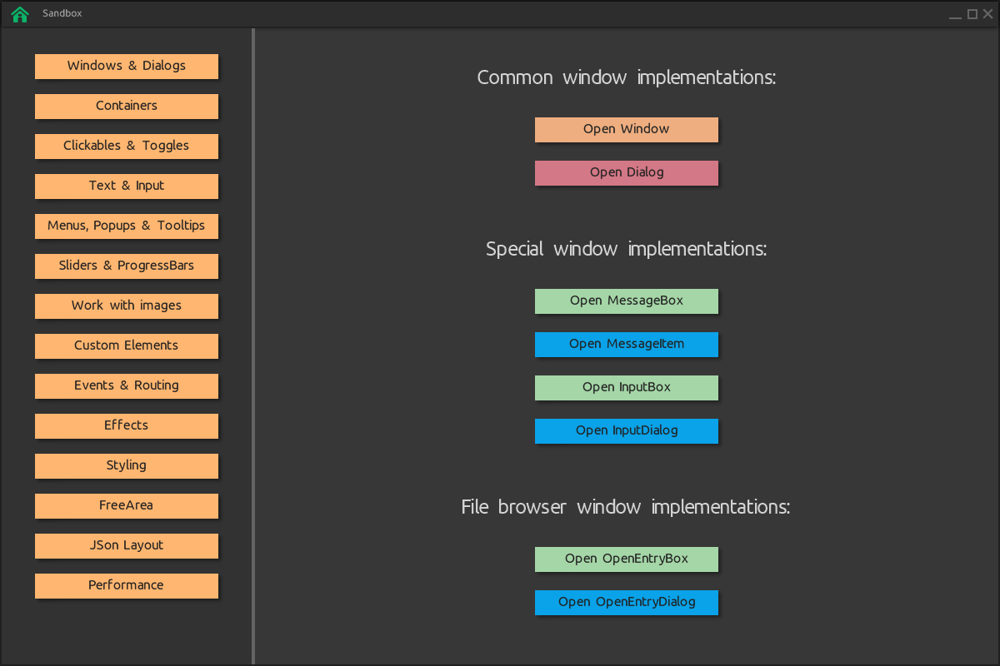

# SpaceVIL
**[SpaceVIL](http://spvessel.com/index.html)** (Space of Visual Items Layout) is a cross-platform and multilingual framework for **creating GUI client applications for .NET Standard, .NET Core and JVM**. SpaceVIL is based on **OpenGL** graphic technology and [glfw](https://www.glfw.org). Using this framework in conjunction with .Net Core or with a JVM, you can work and create graphical client applications on Linux, Mac OS X and Windows.

See more on youtube channel - https://youtu.be/kJ6n1fTHXws

Official web site - http://spvessel.com.

Repository for JVM version of SpaceVIL - https://github.com/spvessel/SpaceVILJava

## How to compile SpaceVIL for .Net Core

Steps:

1. Download and install `dotnet core 6.0`:

    **Windows OS** instruction - https://learn.microsoft.com/en-us/dotnet/core/install/windows?tabs=net60

    **Mac OS** instruction - https://learn.microsoft.com/en-us/dotnet/core/install/macos

    **Linux OS** (Ubuntu) instruction - https://learn.microsoft.com/en-us/dotnet/core/install/linux-ubuntu

2. Download and install `nuget` for you OS according to the instructions - https://learn.microsoft.com/en-us/nuget/install-nuget-client-tools#cli-tools

3. Compile SpaceVIL via terminal:

```
# Windows OS:

> cd SpaceVIL
> compile.bat
```

```
# Mac OS and Linux OS:

> cd SpaceVIL
> compile.sh
```

4. After compilation, you will see `com.spvessel.spacevil` directory with the `nuget` **SpaceVIL** package inside.


## How to run `sanbox` SpaceVIL example

Steps:

1. After compilation steps you can go to `/sandbox` directory and run example in terminal:

```
# from the root directory of the repository

> cd sandbox
```

```
# Windows OS

> run-win.bat
```

```
# Mac OS

> run-mac.sh
```

```
# Linux OS

> run-lin.sh
```

2. If the example run was successful, you will see the window:




### Authors
* **Roman Sedaikin**
* **Valeriia Sedaikina**


### License

Examples is licensed under the MIT License. See the LICENSE.md file for details.
